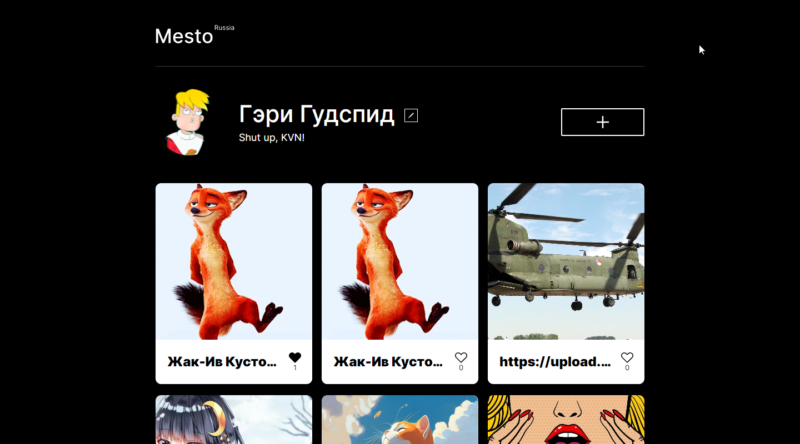

# Проект: Место

Учебный проект выполненный в рамках курса "Веб-разработчик" от Яндекс Практикум. Проект представляет из себя фото-блог с возможностью добавления карточек интересных мест.

## Оглавление

- [Обзор проекта](#обзор-проекта)
  - [Задачи проекта](#задачи-проекта)
  - [Функциональность проекта](#функциональность-проекта)
  - [Screenshot](#screenshot)
  - [Директории проекта](#директории-проекта)
  - [Запуск проекта](#запуск-проекта)
  - [Ссылки](#ссылки)
- [Ход выполнения проекта](#ход-выполнения-проекта)
  - [Используемые технологии](#используемые-технологии)
  - [Чему я научился работая над проектом](#чему-я-научился-работая-над-проектом)
- [Автор](#автор)

## Обзор проекта

### Задачи проекта

Проект был призван изучить основы JS и ООП.

### Функциональность проекта

Проект является интерактивным лендингом, состоящим из нескольких секций. Имеется возможность: установить имя пользователя, информацию «о себе», аватар, добавить\удалить карточку места, поставить\снять лайк карточке. Реализованы различные подходы к позиционированию и выравниванию элементов, в том числе Flexbox и Grid Layout. Проект сделан в соответствии с принципами ООП. Реализованы валидация форм с помощью JS и интеграция с REST API для получения информации о пользователе и карточках. Сборка проекта осуществляется с помощью Webpack.

### Screenshot

### Директории проекта

- `src/blocks` — директория с CSS файлами
- `src/components` — директория с JS модулями
- `src/fonts` — директория со шрифтами
- `src/images` — директория с файлами изображений
- `src/pages` — директория с файлами страниц
- `src/utils` — директория со вспомогательными JS файлами
- `src/vendor` — директория с файлами библиотек

### Запуск проекта

- `npm run build` — запуск проекта в режиме продакшн, с формированием файлов подготовленных к деплою в директории `/dist`
- `npm run dev` — запуск проекта в режиме разработки

### Ссылки

- [Ссылка на репозиторий проекта](https://github.com/Bjorn86/mesto)
- [Ссылка на демо-страницу проекта](https://bjorn86.github.io/mesto/)
- [Ссылка на ветку собранного проекта](https://github.com/Bjorn86/mesto/tree/gh-pages)

## Ход выполнения проекта

### Используемые технологии

- HTML
- CSS
- JS
- Webpack
- БЭМ, включая использование схемы файловой структуры Nested
- Адаптивная вёрстка
- Семантическая вёрстка

### Чему я научился работая над проектом

- Основам JS и ООП
- Инкапсуляции и модульному подходу
- Работе с различными типами данных и их методами
- Работе с классами
- Работе с асинхронным кодом
- Работе с Promise
- Работе с событиями
- Работе с API
- Работе с валидацией форм
- Использованию template-элементов
- Сборке проекта при помощи Webpack

## Автор

**Данила Легкобытов**

- e-mail: [legkobytov-danila@yandex.ru](mailto:legkobytov-danila@yandex.ru)
- Telegram: [@danila_legkobytov](https://t.me/danila_legkobytov)
